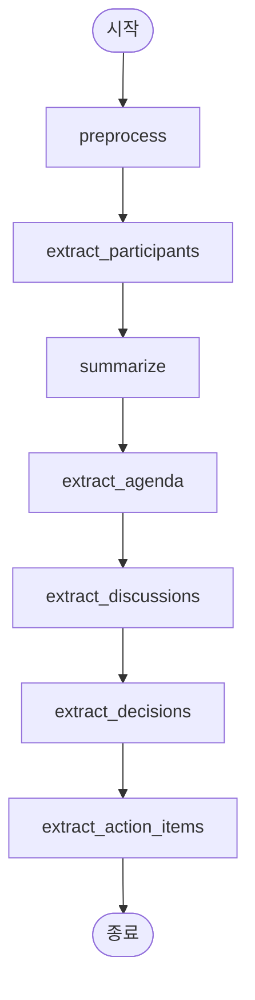

# 회의록 자동 생성 시스템 - 완전 기술 문서

**AI 기반 한국어 회의록 자동 생성 시스템 (EXAONE 2.4B + FastAPI)**

---

## 📑 목차

1. [시스템 개요](#1-시스템-개요)
2. [전체 아키텍처](#2-전체-아키텍처)
3. [폴더 구조](#3-폴더-구조)
4. [모듈별 상세 설명](#4-모듈별-상세-설명)
5. [데이터 흐름](#5-데이터-흐름)
6. [API 명세](#6-api-명세)
7. [설치 및 실행](#7-설치-및-실행)

***

## 1. 시스템 개요

### 1.1 프로젝트 목표

회의 대화 내용을 입력받아 **자동으로 구조화된 회의록**을 생성하는 AI 시스템 구축

### 1.2 핵심 기능

- ✅ **완전 오프라인 실행** - 기밀정보 보호
- ✅ **경량 AI 모델** - 노트북 환경 실행 가능 (EXAONE 2.4B)
- ✅ **상태 기반 워크플로우** - LangGraph StateGraph
- ✅ **RESTful API** - FastAPI 기반 웹 서비스
- ✅ **JSON 입력 지원** - 외부 시스템 통합 가능
- ✅ **Word 파일 출력** - 구조화된 문서 자동 생성

### 1.3 기술 스택

| 분류 | 기술 |
|------|------|
| **AI 모델** | EXAONE 3.5 2.4B (LG AI Research) |
| **프레임워크** | LangGraph 0.2.45, LangChain 0.3.7 |
| **웹 서버** | FastAPI 0.104.0, Uvicorn |
| **문서 생성** | python-docx 1.1.2 |
| **언어** | Python 3.9+ |
| **AI 라이브러리** | HuggingFace Transformers, PyTorch |

***

## 2. 전체 아키텍처

### 2.1 시스템 아키텍처 다이어그램

```
┌─────────────────────────────────────────────────────────────────┐
│                       입력 레이어 (Input Layer)                    │
├─────────────────────────────────────────────────────────────────┤
│  • CLI 입력 (main.py)                                             │
│  • API 입력 (FastAPI)                                             │
│  • JSON 파일 (scripts/process_json.py)                           │
└────────────────────────────┬────────────────────────────────────┘
                             ↓
┌─────────────────────────────────────────────────────────────────┐
│                    상태 관리 레이어 (State Layer)                  │
├─────────────────────────────────────────────────────────────────┤
│  MeetingState (TypedDict)                                        │
│  ┌──────────────────────────────────────────────────────────┐   │
│  │ • raw_transcript: str          (원본 대화)                │   │
│  │ • meeting_title: str           (회의 제목)                │   │
│  │ • meeting_date: str            (회의 날짜)                │   │
│  │ • processed_text: str          (전처리된 텍스트)          │   │
│  │ • participants: List[str]      (참석자)                   │   │
│  │ • summary: str                 (요약)                     │   │
│  │ • agenda_items: List[str]      (안건)                     │   │
│  │ • discussions: List[dict]      (논의 내용)                │   │
│  │ • decisions: List[str]         (결정 사항)                │   │
│  │ • action_items: List[dict]     (액션 아이템)              │   │
│  │ • current_step: str            (현재 단계)                │   │
│  │ • errors: List[str]            (에러 로그)                │   │
│  └──────────────────────────────────────────────────────────┘   │
└────────────────────────────┬────────────────────────────────────┘
                             ↓
┌─────────────────────────────────────────────────────────────────┐
│              처리 파이프라인 레이어 (Processing Pipeline)           │
├─────────────────────────────────────────────────────────────────┤
│  LangGraph StateGraph (7개 노드)                                 │
│                                                                  │
│  [Node 1] preprocess_node                                       │
│     ├─ 입력: raw_transcript                                     │
│     ├─ 처리: 텍스트 정제, 구조화                                 │
│     └─ 출력: processed_text                                     │
│                                                                  │
│  [Node 2] extract_participants_node                             │
│     ├─ 입력: processed_text                                     │
│     ├─ 처리: 참석자 이름 추출                                    │
│     └─ 출력: participants                                       │
│                                                                  │
│  [Node 3] summarize_node                                        │
│     ├─ 입력: processed_text                                     │
│     ├─ 처리: 회의 내용 요약 (3-5문장)                            │
│     └─ 출력: summary                                            │
│                                                                  │
│  [Node 4] extract_agenda_node                                   │
│     ├─ 입력: processed_text                                     │
│     ├─ 처리: 안건 항목 추출                                      │
│     └─ 출력: agenda_items                                       │
│                                                                  │
│  [Node 5] extract_discussions_node                              │
│     ├─ 입력: processed_text                                     │
│     ├─ 처리: 주제별 논의 내용 추출                               │
│     └─ 출력: discussions                                        │
│                                                                  │
│  [Node 6] extract_decisions_node                                │
│     ├─ 입력: processed_text                                     │
│     ├─ 처리: 결정/합의 사항 추출                                 │
│     └─ 출력: decisions                                          │
│                                                                  │
│  [Node 7] extract_action_items_node                             │
│     ├─ 입력: processed_text                                     │
│     ├─ 처리: 작업, 담당자, 마감일 추출                           │
│     └─ 출력: action_items                                       │
│                                                                  │
└────────────────────────────┬────────────────────────────────────┘
                             ↓
┌─────────────────────────────────────────────────────────────────┐
│                    AI 모델 레이어 (LLM Layer)                      │
├─────────────────────────────────────────────────────────────────┤
│  EXAONE 3.5 2.4B (LG AI Research)                               │
│  ┌──────────────────────────────────────────────────────────┐   │
│  │ • 모델 크기: 2.4B 파라미터 (~5GB)                         │   │
│  │ • 특징: 한국어 특화, 노트북 실행 가능                     │   │
│  │ • 로딩: HuggingFace Transformers + PyTorch              │   │
│  │ • 추론: CPU/GPU 자동 감지, 메모리 최적화                 │   │
│  │ • 설정: Temperature=0.2 (일관성 우선)                   │   │
│  └──────────────────────────────────────────────────────────┘   │
└────────────────────────────┬────────────────────────────────────┘
                             ↓
┌─────────────────────────────────────────────────────────────────┐
│                 문서 생성 레이어 (Document Layer)                  │
├─────────────────────────────────────────────────────────────────┤
│  MeetingMinutesDocGenerator (python-docx)                       │
│  ┌──────────────────────────────────────────────────────────┐   │
│  │ • 제목: 회의 제목                                          │   │
│  │ • 회의 정보: 일시, 참석자                                  │   │
│  │ • 요약: 회의 내용 요약                                     │   │
│  │ • 안건: 불릿 리스트                                        │   │
│  │ • 논의 내용: 구조화된 단락                                 │   │
│  │ • 결정 사항: 불릿 리스트                                   │   │
│  │ • 액션 아이템: 표 형식                                     │   │
│  │ • 한글 폰트: 맑은 고딕 (Malgun Gothic)                    │   │
│  └──────────────────────────────────────────────────────────┘   │
└────────────────────────────┬────────────────────────────────────┘
                             ↓
┌─────────────────────────────────────────────────────────────────┐
│                     출력 레이어 (Output Layer)                     │
├─────────────────────────────────────────────────────────────────┤
│  • Word 파일 (.docx)                                             │
│  • 저장 위치: output/회의록_YYYYMMDD_HHMMSS.docx                 │
│  • API 응답: JSON (파일 경로, 회의 정보, 에러 로그)                │
└─────────────────────────────────────────────────────────────────┘
```

### 2.2 컴포넌트 다이어그램

```
┌─────────────────────────────────────────────────────────┐
│                    FastAPI Application                  │
│  ┌──────────────────────────────────────────────────┐   │
│  │  app.py (메인 서버)                                │   │
│  │    ├─ CORS 미들웨어                                │   │
│  │    ├─ 라우터 등록                                   │   │
│  │    └─ Lifespan 관리 (모델 사전 로드)               │   │
│  └──────────────────────────────────────────────────┘   │
│  ┌──────────────────────────────────────────────────┐   │
│  │  meeting_minutes.api.routes                      │   │
│  │    ├─ /health (헬스 체크)                          │   │
│  │    ├─ /generate-minutes (회의록 생성)              │   │
│  │    ├─ /generate-minutes/simple (간단 입력)         │   │
│  │    ├─ /generate-minutes/with-file (파일 직접 반환) │   │
│  │    └─ /download/{filename} (파일 다운로드)         │   │
│  └──────────────────────────────────────────────────┘   │
└─────────────────────────────────────────────────────────┘
                           ↕
┌─────────────────────────────────────────────────────────┐
│                   Core Business Logic                   │
│  ┌──────────────────────────────────────────────────┐   │
│  │  meeting_minutes.core                            │   │
│  │    ├─ state_schema.py (상태 정의)                  │   │
│  │    ├─ llm_config.py (AI 모델 설정)                 │   │
│  │    └─ prompt_templates.py (프롬프트 템플릿)        │   │
│  └──────────────────────────────────────────────────┘   │
│  ┌──────────────────────────────────────────────────┐   │
│  │  meeting_minutes.nodes                           │   │
│  │    ├─ preprocessing.py (전처리)                    │   │
│  │    ├─ summarization.py (요약)                      │   │
│  │    └─ extraction.py (정보 추출 ×5)                 │   │
│  └──────────────────────────────────────────────────┘   │
│  ┌──────────────────────────────────────────────────┐   │
│  │  meeting_minutes.graph                           │   │
│  │    └─ builder.py (LangGraph 워크플로우 구성)       │   │
│  └──────────────────────────────────────────────────┘   │
│  ┌──────────────────────────────────────────────────┐   │
│  │  meeting_minutes.output                          │   │
│  │    └─ document_generator.py (Word 생성)           │   │
│  └──────────────────────────────────────────────────┘   │
└─────────────────────────────────────────────────────────┘
                           ↕
┌─────────────────────────────────────────────────────────┐
│                      Utilities                          │
│  ┌──────────────────────────────────────────────────┐   │
│  │  meeting_minutes.utils                           │   │
│  │    ├─ text_utils.py (텍스트 처리)                  │   │
│  │    ├─ validators.py (유효성 검증)                  │   │
│  │    └─ state_converter.py (State 변환)             │   │
│  └──────────────────────────────────────────────────┘   │
└─────────────────────────────────────────────────────────┘
```

***

## 3. 폴더 구조

### 3.1 전체 디렉토리 트리

```
meeting-minutes-generator/
│
├── meeting_minutes/              # 메인 패키지
│   │
│   ├── __init__.py              # 패키지 초기화
│   │
│   ├── core/                    # 핵심 모듈
│   │   ├── __init__.py
│   │   ├── state_schema.py      # MeetingState 정의
│   │   ├── llm_config.py        # LLM 설정 및 로딩
│   │   └── prompt_templates.py  # 프롬프트 템플릿
│   │
│   ├── nodes/                   # 처리 노드
│   │   ├── __init__.py
│   │   ├── preprocessing.py     # 텍스트 전처리
│   │   ├── summarization.py     # 회의 요약
│   │   └── extraction.py        # 정보 추출 (×6 함수)
│   │
│   ├── graph/                   # LangGraph 워크플로우
│   │   ├── __init__.py
│   │   └── builder.py           # StateGraph 구성
│   │
│   ├── output/                  # 문서 생성
│   │   ├── __init__.py
│   │   └── document_generator.py # Word 파일 생성
│   │
│   ├── utils/                   # 유틸리티
│   │   ├── __init__.py
│   │   ├── text_utils.py        # 텍스트 처리 함수
│   │   ├── validators.py        # 유효성 검증
│   │   └── state_converter.py   # JSON/Dict → State 변환
│   │
│   └── api/                     # FastAPI 관련
│       ├── __init__.py
│       ├── models.py            # Pydantic 모델
│       ├── routes.py            # API 라우트
│       └── dependencies.py      # 의존성 주입
│
├── scripts/                     # 스크립트
│   └── process_json.py          # JSON 파일 처리
│
├── data/                        # 데이터
│   ├── input/                   # JSON 입력 파일
│   │   ├── sample_meeting_1.json
│   │   ├── sample_meeting_2.json
│   │   └── sample_meeting_3.json
│   └── samples/                 # 샘플 데이터
│
├── output/                      # 생성된 회의록 (자동 생성)
│   └── 회의록_YYYYMMDD_HHMMSS.docx
│
├── app.py                       # FastAPI 서버
├── main.py                      # CLI 실행 파일
├── config.py                    # 설정 파일
├── requirements.txt             # Python 의존성
├── .env                         # 환경 변수 (선택)
├── README.md                    # 기본 문서
└── README_API.md                # API 문서
```

### 3.2 파일별 역할 요약

| 파일 경로 | 라인 수 | 주요 기능 |
|-----------|---------|-----------|
| `meeting_minutes/core/state_schema.py` | ~150 | MeetingState 정의, 초기 상태 생성 |
| `meeting_minutes/core/llm_config.py` | ~250 | EXAONE 모델 로드 및 추론 |
| `meeting_minutes/core/prompt_templates.py` | ~200 | 7개 노드용 프롬프트 템플릿 |
| `meeting_minutes/nodes/preprocessing.py` | ~50 | 텍스트 전처리 노드 |
| `meeting_minutes/nodes/summarization.py` | ~50 | 요약 생성 노드 |
| `meeting_minutes/nodes/extraction.py` | ~350 | 정보 추출 6개 노드 |
| `meeting_minutes/graph/builder.py` | ~100 | LangGraph 워크플로우 구성 |
| `meeting_minutes/output/document_generator.py` | ~300 | Word 문서 생성 |
| `meeting_minutes/api/routes.py` | ~250 | FastAPI 엔드포인트 5개 |
| `meeting_minutes/api/models.py` | ~100 | Pydantic 모델 정의 |
| `app.py` | ~100 | FastAPI 서버 메인 |
| `main.py` | ~200 | CLI 실행 + 샘플 폴백 |
| `config.py` | ~50 | 설정 관리 (Pydantic Settings) |

***

## 4. 모듈별 상세 설명

### 4.1 Core Module (meeting_minutes/core/)

#### 4.1.1 state_schema.py

**목적:** 전체 시스템의 상태 정의 및 관리

**주요 클래스/함수:**

```python
class MeetingState(TypedDict):
    """회의록 생성을 위한 상태 스키마"""
    raw_transcript: str              # 원본 대화 내용
    meeting_title: str               # 회의 제목
    meeting_date: str                # 회의 날짜
    processed_text: str              # 전처리된 텍스트
    summary: str                     # 회의 요약
    participants: List[str]          # 참석자 목록
    agenda_items: Annotated[List[str], operator.add]
    discussions: Annotated[List[dict], operator.add]
    decisions: Annotated[List[str], operator.add]
    action_items: Annotated[List[dict], operator.add]
    current_step: str                # 현재 처리 단계
    errors: Annotated[List[str], operator.add]

def create_initial_state(transcript, title, date) -> MeetingState:
    """초기 상태 생성"""
    
def validate_state(state) -> bool:
    """상태 유효성 검증"""
```

**특징:**
- `TypedDict` 사용으로 타입 안정성 보장
- `Annotated[List, operator.add]`로 리스트 자동 병합
- LangGraph StateGraph와 완벽 호환

#### 4.1.2 llm_config.py

**목적:** AI 모델 로드 및 추론 관리

**주요 클래스:**

```python
class LightweightLLMConfig:
    """경량 HuggingFace LLM 설정"""
    
    RECOMMENDED_MODELS = {
        "exaone-2.4b": "LGAI-EXAONE/EXAONE-3.5-2.4B-Instruct",
        "qwen-1.5b": "Qwen/Qwen2.5-1.5B-Instruct",
        "qwen-3b": "Qwen/Qwen2.5-3B-Instruct",
    }
    
    def __init__(self, model_name, device, max_length, temperature):
        """모델 설정 초기화"""
    
    def load_model(self):
        """모델 및 토크나이저 로드 (캐시 지원)"""
    
    def generate(self, prompt, system_prompt) -> str:
        """텍스트 생성"""
    
    def test_connection(self) -> bool:
        """모델 테스트"""
```

**특징:**
- HuggingFace 캐시 자동 활용 (~/.cache/huggingface)
- CPU/GPU 자동 감지
- 메모리 최적화 (low_cpu_mem_usage, 8bit 양자화 옵션)

#### 4.1.3 prompt_templates.py

**목적:** 각 노드에서 사용할 프롬프트 템플릿 제공

**주요 메서드:**

```python
class PromptTemplates:
    @staticmethod
    def get_preprocessing_prompt() -> str:
        """전처리 프롬프트"""
    
    @staticmethod
    def get_participant_extraction_prompt() -> str:
        """참석자 추출 프롬프트"""
    
    @staticmethod
    def get_summary_prompt() -> str:
        """요약 프롬프트"""
    
    # ... 총 7개 프롬프트 메서드
```

**특징:**
- 한국어 최적화 프롬프트
- 명확한 출력 형식 지정 (JSON, 리스트 등)
- Few-shot 예시 포함

### 4.2 Nodes Module (meeting_minutes/nodes/)

#### 4.2.1 처리 노드 흐름

```
preprocess_node
   ↓
extract_participants_node
   ↓
summarize_node
   ↓
extract_agenda_node
   ↓
extract_discussions_node
   ↓
extract_decisions_node
   ↓
extract_action_items_node
```

#### 4.2.2 노드 공통 구조

```python
def node_function(state: MeetingState) -> dict:
    """노드 함수 템플릿"""
    print(f"[Step X/7] 처리 중...")
    
    try:
        # 1. 프롬프트 생성
        prompt = PromptTemplates.get_xxx_prompt().format(
            text=state["processed_text"]
        )
        
        # 2. LLM 호출
        response = llm_config.generate(prompt)
        
        # 3. 후처리 (JSON 파싱, 리스트 분할 등)
        result = process_response(response)
        
        print(f"✓ 처리 완료")
        
        # 4. 상태 업데이트 반환
        return {
            "field_name": result,
            "current_step": "step_name"
        }
    
    except Exception as e:
        print(f"✗ 오류: {e}")
        return {
            "errors": [f"오류: {str(e)}"],
            "current_step": "step_name"
        }
```

### 4.3 Graph Module (meeting_minutes/graph/)

#### 4.3.1 builder.py

**LangGraph 워크플로우 구성:**

```python
def build_meeting_minutes_graph():
    """회의록 생성 그래프 구축"""
    
    # 1. StateGraph 생성
    workflow = StateGraph(MeetingState)
    
    # 2. 노드 추가 (7개)
    workflow.add_node("preprocess", preprocess_node)
    workflow.add_node("extract_participants", extract_participants_node)
    # ... 5개 더
    
    # 3. 엣지 연결 (순차 실행)
    workflow.set_entry_point("preprocess")
    workflow.add_edge("preprocess", "extract_participants")
    workflow.add_edge("extract_participants", "summarize")
    # ... 계속
    workflow.add_edge("extract_action_items", END)
    
    # 4. 컴파일
    return workflow.compile()
```

**그래프 시각화 (Mermaid):**



### 4.4 Output Module (meeting_minutes/output/)

#### 4.4.1 document_generator.py

**Word 문서 생성 로직:**

```python
class MeetingMinutesDocGenerator:
    def __init__(self):
        self.doc = Document()
        self._setup_styles()  # 한글 폰트 설정
    
    def generate(self, state: MeetingState, output_path: str):
        """회의록 생성"""
        # 1. 제목
        self._add_title(state["meeting_title"])
        
        # 2. 회의 정보
        self._add_section("회의 정보")
        self._add_paragraph(f"일시: {state['meeting_date']}")
        self._add_paragraph(f"참석자: {', '.join(state['participants'])}")
        
        # 3. 요약
        self._add_section("회의 요약")
        self._add_paragraph(state["summary"])
        
        # 4. 안건 (불릿 리스트)
        self._add_section("안건")
        self._add_bullet_list(state["agenda_items"])
        
        # 5. 논의 내용
        self._add_section("논의 내용")
        for disc in state["discussions"]:
            self._add_paragraph(f"• {disc['topic']}", bold=True)
            self._add_paragraph(f"  {disc['content']}")
        
        # 6. 결정 사항
        self._add_section("결정 사항")
        self._add_bullet_list(state["decisions"])
        
        # 7. 액션 아이템 (표)
        self._add_section("액션 아이템")
        headers = ["작업 내용", "담당자", "마감일"]
        rows = [[item["task"], item["assignee"], item["deadline"]]
                for item in state["action_items"]]
        self._add_table(headers, rows)
        
        # 8. 저장
        self.doc.save(output_path)
        return output_path
```

### 4.5 API Module (meeting_minutes/api/)

#### 4.5.1 routes.py - 주요 엔드포인트

**1. 헬스 체크**
```python
@router.get("/health")
async def health_check():
    return {
        "status": "healthy",
        "model_loaded": llm_config._is_loaded
    }
```

**2. 회의록 생성 (Full State)**
```python
@router.post("/generate-minutes")
async def generate_minutes_full(state_input: MeetingStateInput):
    # State 변환 → 그래프 실행 → 문서 생성
    meeting_state = dict_to_meeting_state(state_input.model_dump())
    final_state, output_path = generate_from_state(meeting_state)
    return MeetingMinutesResponse(...)
```

**3. 간단한 입력**
```python
@router.post("/generate-minutes/simple")
async def generate_minutes_simple(input_data: SimpleMeetingInput):
    # SimpleMeetingInput → MeetingStateInput 변환 후 처리
```

**4. 파일 다운로드**
```python
@router.get("/download/{filename}")
async def download_file(filename: str):
    return FileResponse(path=output_path, ...)
```

**5. 파일 직접 반환**
```python
@router.post("/generate-minutes/with-file")
async def generate_minutes_with_download(state_input: MeetingStateInput):
    # 생성 후 파일 직접 반환 (JSON 응답 대신)
```

***

## 5. 데이터 흐름

### 5.1 End-to-End 데이터 흐름

```
[사용자 입력]
    ↓
┌─────────────────────────────────────────┐
│ 1. 입력 검증 및 State 생성                │
│    - JSON/텍스트 → MeetingState         │
│    - 필수 필드 검증                      │
└─────────────────────────────────────────┘
    ↓
┌─────────────────────────────────────────┐
│ 2. LangGraph 워크플로우 실행             │
│    ┌─────────────────────────────────┐  │
│    │ Node 1: 전처리                   │  │
│    │   Input:  raw_transcript        │  │
│    │   Output: processed_text        │  │
│    └─────────────────────────────────┘  │
│    ┌─────────────────────────────────┐  │
│    │ Node 2: 참석자 추출              │  │
│    │   Input:  processed_text        │  │
│    │   Output: participants          │  │
│    └─────────────────────────────────┘  │
│    ┌─────────────────────────────────┐  │
│    │ Node 3: 요약                     │  │
│    │   Input:  processed_text        │  │
│    │   Output: summary               │  │
│    └─────────────────────────────────┘  │
│    ┌─────────────────────────────────┐  │
│    │ Node 4: 안건 추출                │  │
│    │   Input:  processed_text        │  │
│    │   Output: agenda_items          │  │
│    └─────────────────────────────────┘  │
│    ┌─────────────────────────────────┐  │
│    │ Node 5: 논의 내용 추출           │  │
│    │   Input:  processed_text        │  │
│    │   Output: discussions           │  │
│    └─────────────────────────────────┘  │
│    ┌─────────────────────────────────┐  │
│    │ Node 6: 결정 사항 추출           │  │
│    │   Input:  processed_text        │  │
│    │   Output: decisions             │  │
│    └─────────────────────────────────┘  │
│    ┌─────────────────────────────────┐  │
│    │ Node 7: 액션 아이템 추출         │  │
│    │   Input:  processed_text        │  │
│    │   Output: action_items          │  │
│    └─────────────────────────────────┘  │
└─────────────────────────────────────────┘
    ↓
┌─────────────────────────────────────────┐
│ 3. 최종 State 생성                       │
│    - 모든 필드 채워짐                    │
│    - 에러 로그 수집                      │
└─────────────────────────────────────────┘
    ↓
┌─────────────────────────────────────────┐
│ 4. Word 문서 생성                        │
│    - python-docx로 구조화               │
│    - 한글 폰트 적용                      │
│    - output/ 디렉토리에 저장             │
└─────────────────────────────────────────┘
    ↓
[출력: .docx 파일 + JSON 응답]
```

### 5.2 State 변화 추적

| 단계 | current_step | 업데이트되는 필드 |
|------|--------------|-------------------|
| 초기 | `initialized` | raw_transcript, meeting_title, meeting_date |
| Node 1 | `preprocessed` | processed_text |
| Node 2 | `participants_extracted` | participants |
| Node 3 | `summarized` | summary |
| Node 4 | `agenda_extracted` | agenda_items |
| Node 5 | `discussions_extracted` | discussions |
| Node 6 | `decisions_extracted` | decisions |
| Node 7 | `action_items_extracted` | action_items |

***

## 6. API 명세

### 6.1 Base URL

```
http://127.0.0.1:8000/api/v1
```

### 6.2 엔드포인트 목록

| 메서드 | 경로 | 설명 |
|--------|------|------|
| GET | `/health` | 헬스 체크 |
| POST | `/generate-minutes` | 회의록 생성 (Full State) |
| POST | `/generate-minutes/simple` | 회의록 생성 (간단) |
| POST | `/generate-minutes/with-file` | 회의록 생성 + 파일 반환 |
| GET | `/download/{filename}` | 파일 다운로드 |

### 6.3 요청/응답 예시

**POST /api/v1/generate-minutes**

요청:
```json
{
  "raw_transcript": "김대리: 회의를 시작합니다...",
  "meeting_title": "프로젝트 회의",
  "meeting_date": "2025-10-28"
}
```

응답:
```json
{
  "success": true,
  "message": "회의록이 성공적으로 생성되었습니다!",
  "output_file": "output\\회의록_20251028_223045.docx",
  "meeting_info": {
    "title": "프로젝트 회의",
    "date": "2025-10-28",
    "participants": ["김대리", "이과장"],
    "agenda_count": 2,
    "action_items_count": 1
  },
  "errors": []
}
```

***

## 7. 설치 및 실행

### 7.1 환경 요구사항

- **OS**: Windows 10/11, macOS, Linux
- **Python**: 3.9 이상
- **RAM**: 최소 8GB (권장 16GB)
- **디스크**: 최소 10GB (모델 캐시 포함)
- **GPU**: 선택사항 (CUDA 지원 시 빠름)

### 7.2 설치

```bash
# 1. 저장소 클론
git clone <repository-url>
cd meeting-minutes-generator

# 2. 가상환경 생성
python -m venv venv
source venv/bin/activate  # Windows: venv\Scripts\activate

# 3. 패키지 설치
pip install -r requirements.txt
```

### 7.3 실행

```bash
# API 서버 실행
python app.py

# CLI 실행 (샘플 데이터)
python main.py --sample

# JSON 파일 처리
python scripts/process_json.py data/input/sample_meeting_1.json
```

### 7.4 첫 실행 시

- EXAONE 2.4B 모델 자동 다운로드 (약 5GB)
- 다운로드 시간: 5-10분 (인터넷 속도에 따라)
- 이후 실행: 캐시 사용으로 즉시 시작

***
